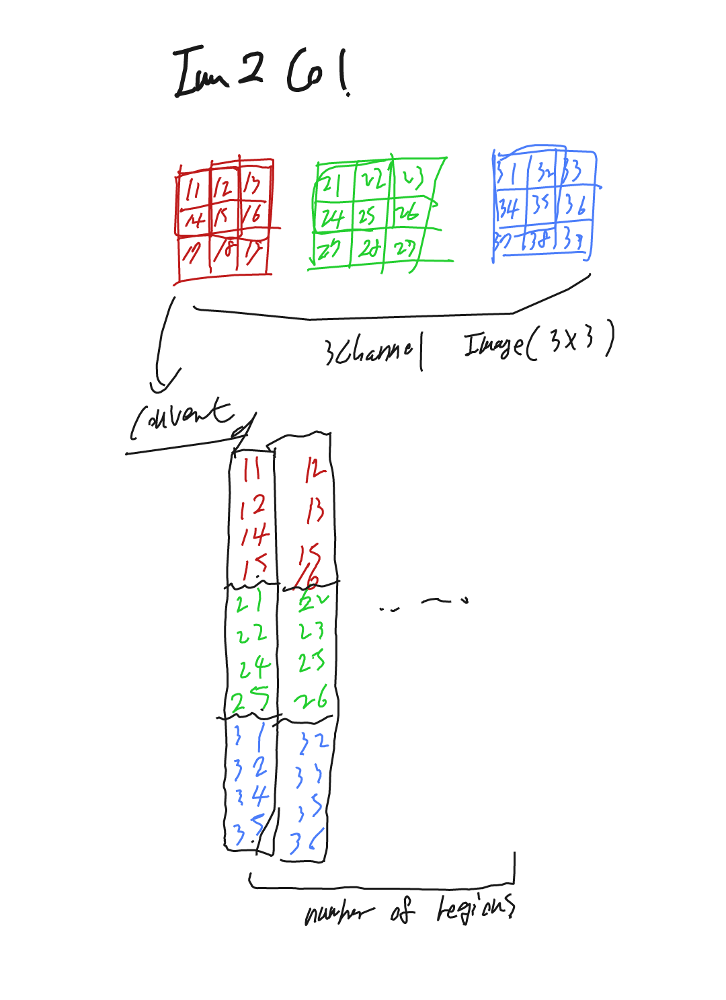
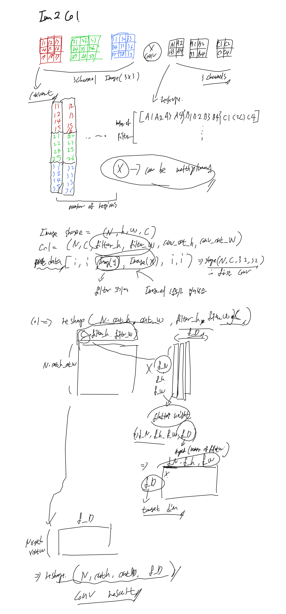
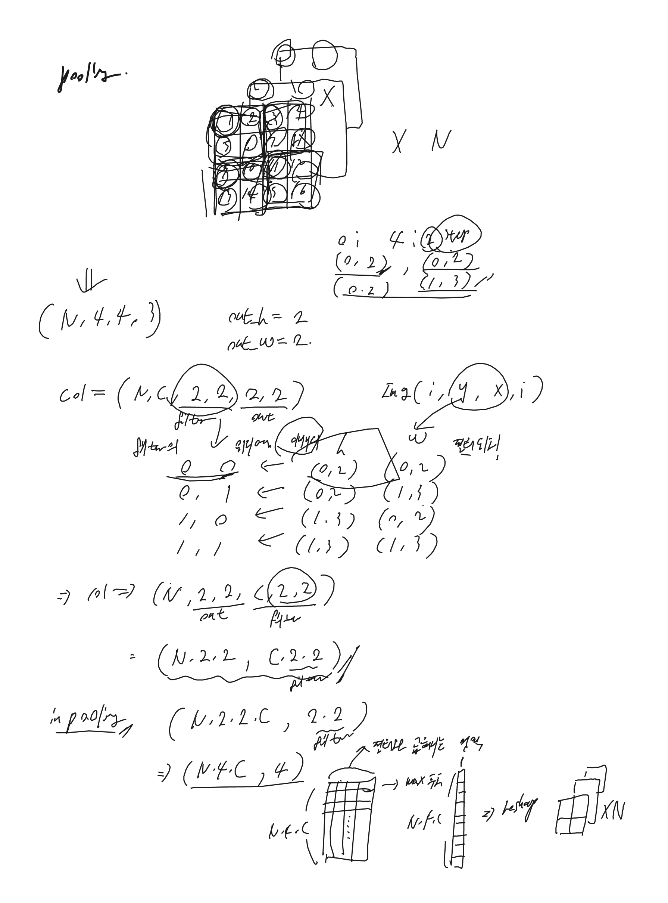
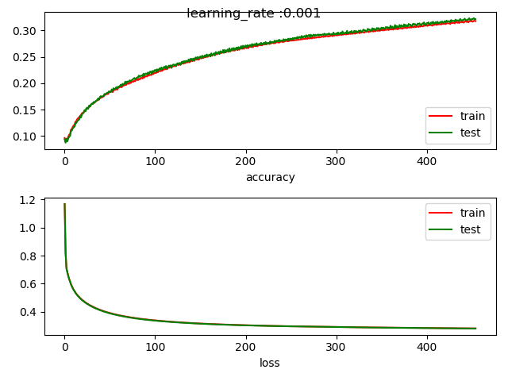
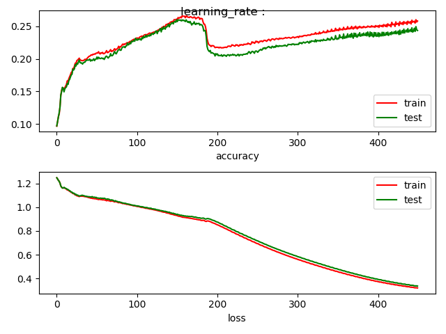

<h1>CNN scratch</h1>

**Make CNN without tensor-flow.**  
This project is make pure Convolution Neural Network **without any deeplearning library**.  

<h3>Structure of project</h3>  

~~~  
-cnn_scratch : 
  ├─ -cnn : packge of cnn.
  │   │
  │   ├─ -datas.py : Data-Manager for this model. Load data, divide data, etc..
  │   │
  │   ├─ -model.py : Main network models include activate functions, feed-forword, bac
  │   │
  │   └─ -tools.py : Plotting tools.
  │
  ├─ -normal_network_test : fully conncted network for comparing with CNN
  │
  └─ -assignment_cnn.py : Main SCRIPT of this project.
~~~
  
---  

<h3>Special methods</h3>

**1. Im2Col()**  
This function make image array to special array. Normal convolution is using a lot of `for-loops` and this make the network slow.
But there are way that make the normal convolution to matrix multiplication.  
**It is fast, but need more memory.** Many Deep-learning platform using this method for calculate convolution.     
Structure of special array looks like below image.  
  
  
Below means calculation of output width and height.
~~~
W_Out = ((W_in -W_filter + 2*Padding)/Stride + 1)
H_Out = ((H_in -H_filter + 2*Padding)/Stride + 1)
~~~  

**2. Col2Im()**  
This function make special array that is flatted for calculation to image array. When the error is backpropagated, the row col can be conveted to image array.  

  
---  

<h3>Structure of Network</h3>  

This Network can be divided into *3 parts*.  
* `Convolution` Layer & Activation & `Pooling`
* Fully Connected Layer 
* Softmax Layer  

  
---

* **FeedForward of Conv Layer**  
In this layer, Filter moved pixels of stride at once(Check the below image) and element-wise multiply with the image region(and sum all elements).  
Depending on the filter depth(means number of filters), image channels are changed.  
`OUT_Height = (INPUT_Height + 2*Padding - filter_Height)/Stride + 1`  
`OUT_width = (INPUT_Width + 2*Padding - filter_Width)/Stride + 1`  
    

* **FeedForward of pooling Layer**   
The pooling(Max-pooling in this Network) reduce the image size.  
  

* **Back-propagation of pooling Layer**   
In back-propagation of pooling, back-propagated error width, and height are expanded.  
~~~
# NOTICE : pooling back.
# un flat.
error_back = error_back.reshape([-1, 8, 8, 32])

# flated pooling
flated_pool = np.zeros((error_back.size, 4))
flated_pool[np.arange(len(max_loc_y2)), max_loc_y2.flatten()] = error_back.flatten()
flated_pool = flated_pool.reshape(error_back.shape + (4,))
flated_pool = flated_pool.reshape(flated_pool.shape[0] * flated_pool.shape[1] * flated_pool.shape[2], -1)
error_back = self.Col2Im(flated_pool, [len(x), 16, 16, 32], 2, 2, stride=2, pad=0)
~~~   

* **Back-propagation of Conv Layer**   
Im2Col Made the Feedforward looks like Normal NeuralNetwork(`wx + b`).  
If use the Col2Im method, Back-propagation also same as NeuralNetwork.  
~~~
error_back = error_back.reshape([-1, self.w2.shape[-1]])
d_w2 = np.dot(flatten_y2.T, error_back)
d_w2 = np.transpose(d_w2.transpose([1, 0]).reshape([32, 16, 3, 3]), [2, 3, 1, 0])
d_b2 = np.sum(error_back, axis=0)

flat_conv = np.dot(error_back, (self.w2.reshape(32, -1).T).T)
error_back = self.Col2Im(flat_conv, [len(x), 16, 16, 16], 3, 3, stride=1, pad=1)
~~~  
  
* **FeedFoward and back-propagation of Fully Connected and Softmax Layer**  
Same as the Normal Neural Network's layer.  

  
---  

<h3>Result of CNN  
(Cifar10 Dataset)</h3>  

I used the `cross-entropy` loss and `mini-batch Gradient Descent`.  
And Train network for *90* epochs, Each epoch run for *50* iterations. (Used batch size *1,000*)  
I spent more than 12 hours.  

~~~
============== EPOCH 89 START ==============
batch0 data trained
batch10 data trained
batch20 data trained
batch30 data trained
batch40 data trained
============== EPOCH 89 END ================
train accuracy : 0.3177; loss : 0.281, test accuracy : 0.321; loss : 0.281
============== EPOCH 90 START ==============
batch0 data trained
batch10 data trained
batch20 data trained
batch30 data trained
batch40 data trained
============== EPOCH 90 END ================
train accuracy : 0.3189; loss : 0.281, test accuracy : 0.322; loss : 0.28
~~~
  
 
 
 ---  
 
 <h3>Comparing with Fully Connected Network  
 (Cifar10 Dataset)</h3>  
 Below plotting graph is train of normal fully connected neural network.  
 
 ~~~
 ============== EPOCH 89 START ==============
============== EPOCH 89 END ================
train accuracy : 0.2565; loss : 0.322, test accuracy : 0.247; loss : 0.338
============== EPOCH 90 START ==============
============== EPOCH 90 END ================
train accuracy : 0.2574; loss : 0.318, test accuracy : 0.247; loss : 0.333
 ~~~
   
    

- This is the comparing table(at Epoch:90).  
- Normal Neural Network using `Adam` optimizer, Convolution Neural Network using `Gradient Descent`.

|                         | Normal Neural network(`ADAM`) | Convolution Neural Network(`GD`)|
|:-----------------------:|:---------------------:|:-------------------------:|
|   **Train accuracy**    |        25.74%         |         **31.89%**        |        
|     **Train loss**      |          0.318        |              0.281        |      
|   **Test accuracy**     |           24.7%       |          **32.2%**        |        
|      **Test loss**      |         0.333         |               0.28        |  
 